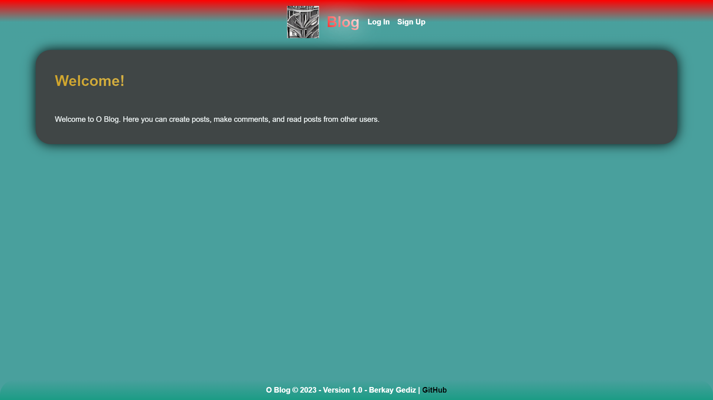
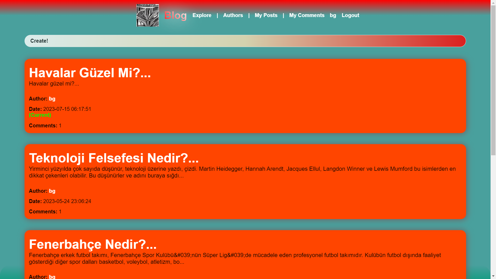
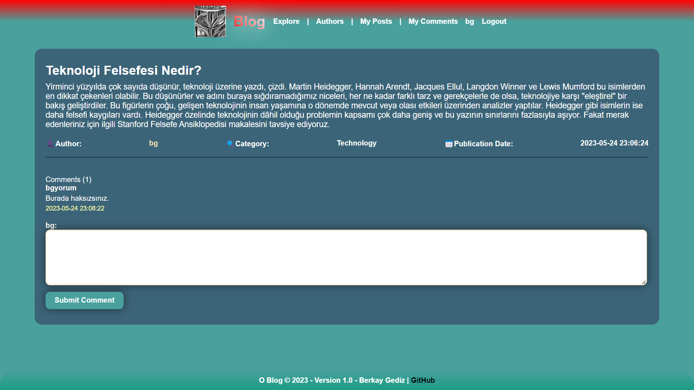
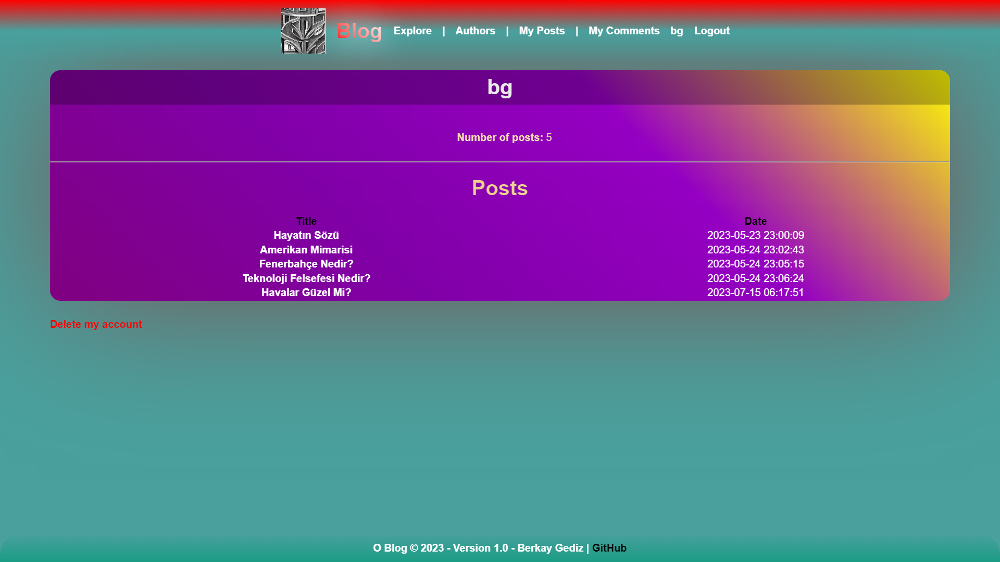

# O Blog: Social Article Network

**O Blog** is your gateway to the world of blogging. Express yourself, manage your content effortlessly, connect with your readers through comments, and explore a vibrant community of bloggers. Our platform offers an array of features designed to elevate your blogging experience.

## **Features**

- **User-Friendly Registration and Login**: Seamlessly create your account and securely log in to unleash your creativity.

- **Effortless Article Management**: Write, edit, and delete your articles with ease. Craft your content to perfection before unveiling it to the world.

- **Engage with Readers**: Foster discussions with your audience through comments. Share insights, answer queries, and build a loyal readership.

- **Discover Fellow Bloggers**: Dive into a diverse community of bloggers, explore their profiles, and find captivating content.

- **Organized Categories**: Categorize your articles for easy navigation and an enhanced user experience.

- **Robust Security Features**: Your security is our priority. Benefit from XSS protection, CSRF protection, and hashed passwords.

- **Admin Panel**: Take charge of your blog with a user-friendly admin panel that simplifies management tasks.

- **More Exciting Features Ahead**: Stay tuned! We're committed to enhancing your blogging experience with more exciting features in the pipeline.

## **Snapshots**

## **System Requirements**

To embark on your O Blog journey, ensure your system meets these requirements:

- **PHP 8.0.0 or higher**
- **MySQL 8.0.0 or higher**

## **License**

It's released under the Apache License 2.0, granting you the freedom to use, modify, and distribute the software within the framework of the license.

## **False Flags**

MITRE: [CVE-2023-38899](https://cve.mitre.org/cgi-bin/cvename.cgi?name=CVE-2023-38899)

NIST.GOV: [CVE-2023-38899](https://nvd.nist.gov/vuln/detail/CVE-2023-38899)
