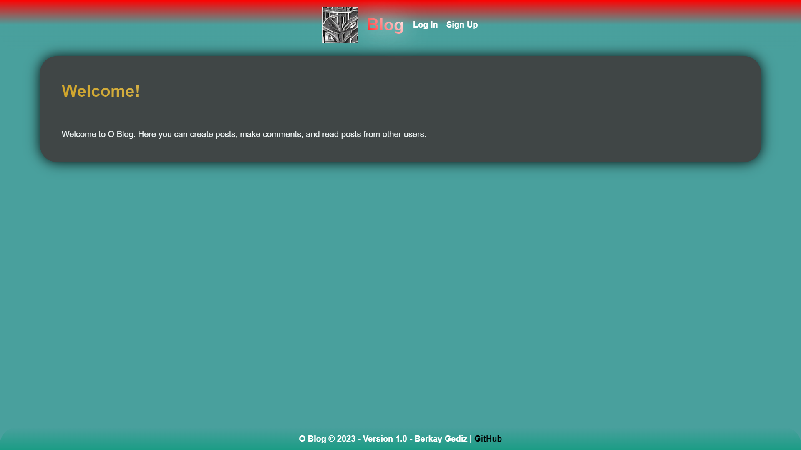
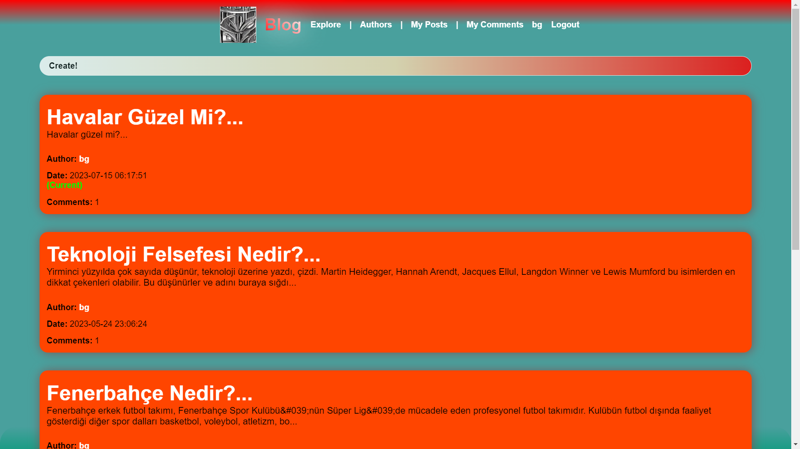
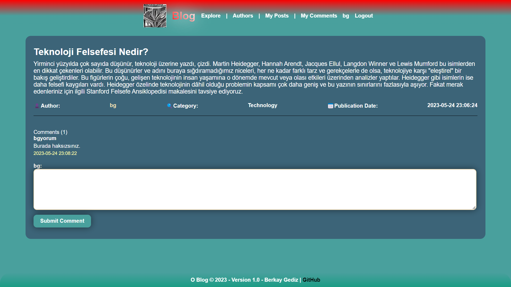
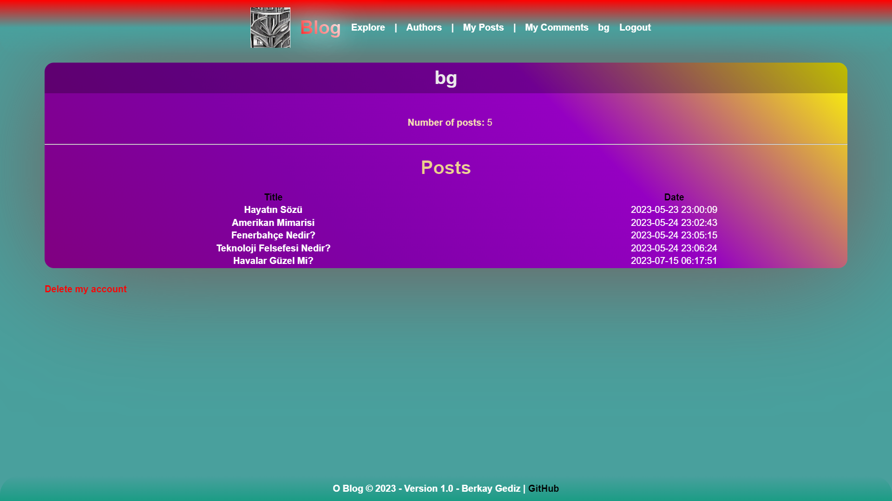

# O Blog

A lightweight social article network built with raw PHP and MySQL. Features include secure user authentication, article management, a comment system, and a dedicated admin panel with built-in XSS/CSRF protection.

| Home | Post | Admin | Profile |
|:---:|:---:|:---:|:---:|
|  |  |  |  |

## Setup

Requires PHP 8.0+ and MySQL 8.0+.

1. Import `database/o_blog.sql`.
2. Configure DB credentials in `includes/connect.php`.
3. Run `php -S localhost:8000`.

*Note: Reviewed for [CVE-2023-38899](https://nvd.nist.gov/vuln/detail/CVE-2023-38899); no vulnerability found in this context.*

## License

Apache License 2.0. See [LICENSE](LICENSE).